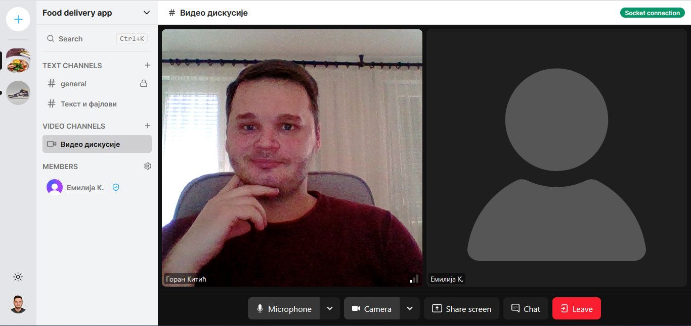

# 🖥️ Connect

Connect is a student project and a simple full-stack web application for teamwork projects where team workers can discuss projects live during video calls or by sending text messages, images, or files.

Application is inspired by Discord application and created in process of learning Next.js, TypeScript, TailwindCSS, Prisma ORM, and Socket.io.

👦🏻 The creator of the project/server is automatically the admin so he/she can send invitations to other users, and make them admins or moderators. 
Admins and moderators can delete messages in the text channel or kick users who don't belong to a particular text channel.

💻 Apart from the group text and video channel users can communicate in private sending direct messages or making private video calls.

©️ 2024 Goran Kitic

