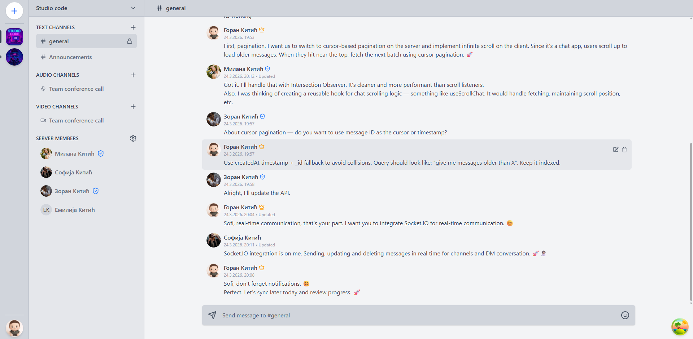

# Connexio 💬

Connexio is a full-stack application inspired by platforms like Discord and MS Teams.

It was built as a student project while learning modern web development technologies including **Node.js, Express, MongoDB, React, TypeScript and Socket.io**.

## ✨ Features

-   🏠 Create and manage servers with channel-based organization
-   🔗 Invite users via unique server invite links
-   🧵 Organized communication through server channels
-   📩 Private direct messages
-   💬 Real-time messaging powered by Socket.io
-   📞 Audio and video calls
-   🔄 Infinite scroll with cursor-based pagination
-   🛡️ Role-based access control (admin and moderators)
-   ⚡ Optimized data fetching with TanStack Query
-   🔑 User authentication and authorization

©️ 2026 Goran Kitic

## 🚀 Tech Stack

### Frontend

-   React
-   TypeScript
-   React Router
-   TanStack Query
-   TailwindCSS

### Backend

-   Node.js
-   Express
-   MongoDB
-   Mongoose
-   Socket.io

## 🛠️ Quick Start Instructions

### 📌 Requirements

-   Node.js 24+
-   MongoDB Atlas
-   NPM or Yarn

### 🚀 Clone the Repository

### 📦 Install Server Dependencies

    cd backend
    npm install

### ⚙️ Configure Server Environment

Create a .env file:

    NODE_ENV=development
    PORT=3000
    CLIENT_ORIGIN=http://localhost:5173
    SERVER_ORIGIN=http://localhost:3000
    MONGO_URI=your-mongodb-uri
    JWT_ACCESS_SECRET=your-secret
    JWT_ACCESS_TOKEN_TTL_MS=900000 || your-expiresIn-time
    TOKEN_BYTES=64
    REFRESH_TOKEN_TTL_MS=604800000 || your-expiresIn-time
    RESEND_API_KEY=your-resend-api-key
    UPLOADCARE_PUBLIC_KEY=your-uploadcare-secret
    UPLOADCARE_SECRET_KEY=your-uploadcare-secret
    LIVEKIT_URL=your-livekit-url
    LIVEKIT_API_KEY=your-livekit-api-key
    LIVEKIT_API_SECRET=your-livekit-api-secret

### 📦 Install Client Dependencies

    cd frontend
    npm install

### ⚙️ Configure Client Environment

Create a .env file:

    VITE_API_URL=http://localhost:3000

### ▶️ Run the Server

Development

    npm run dev

### ▶️ Run the Client

    npm run dev
